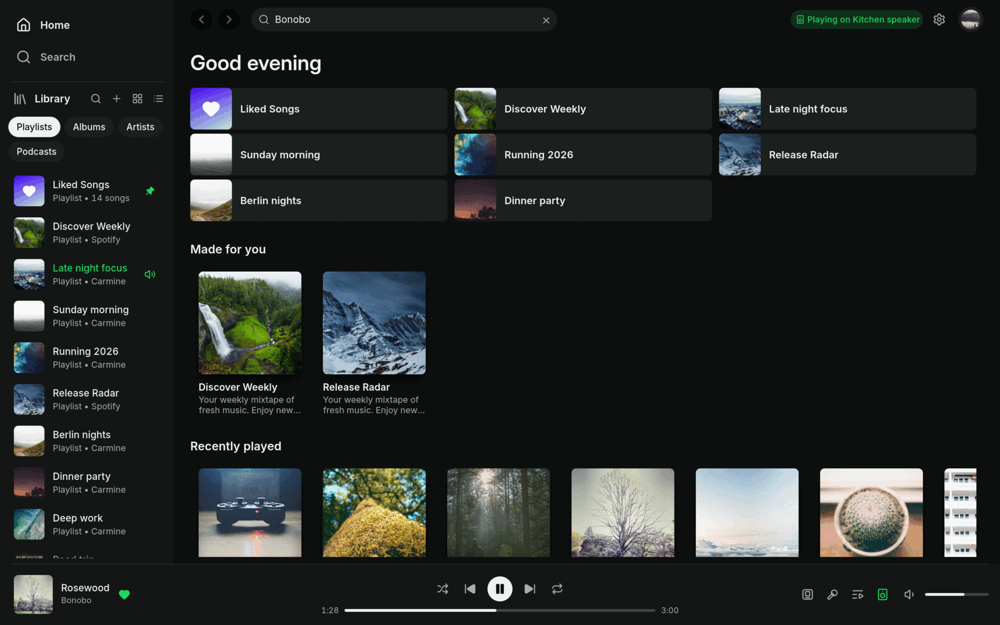
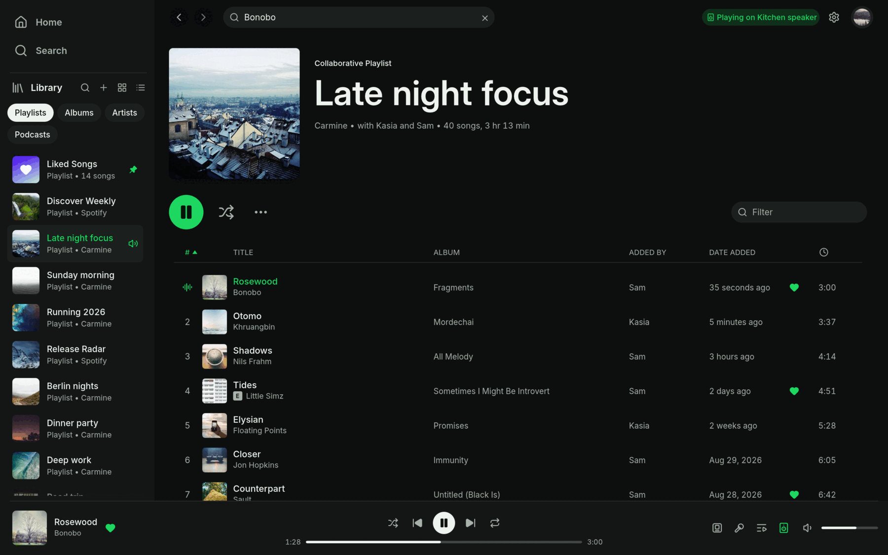
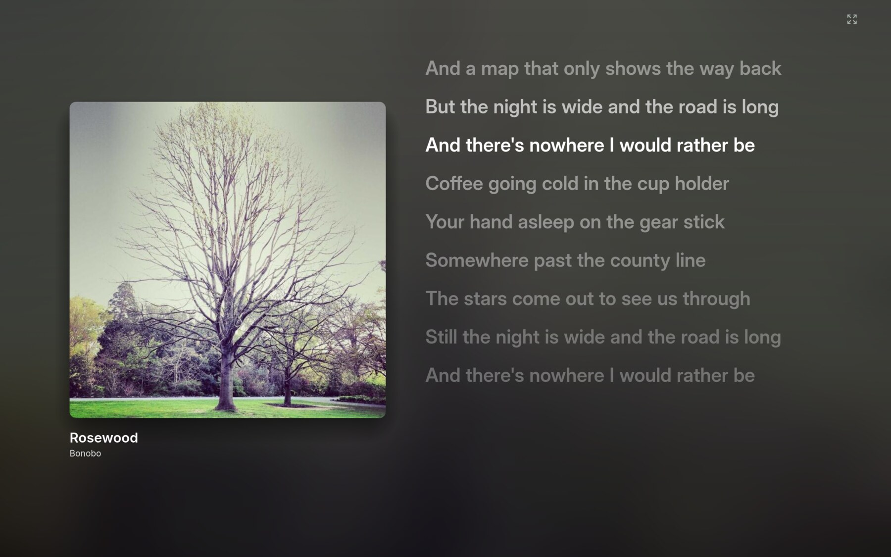
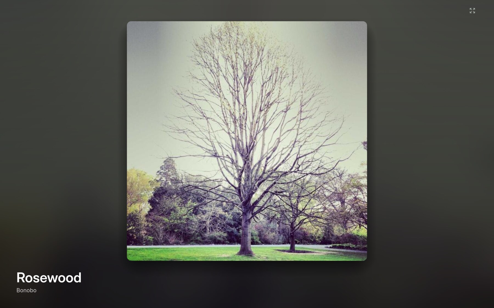
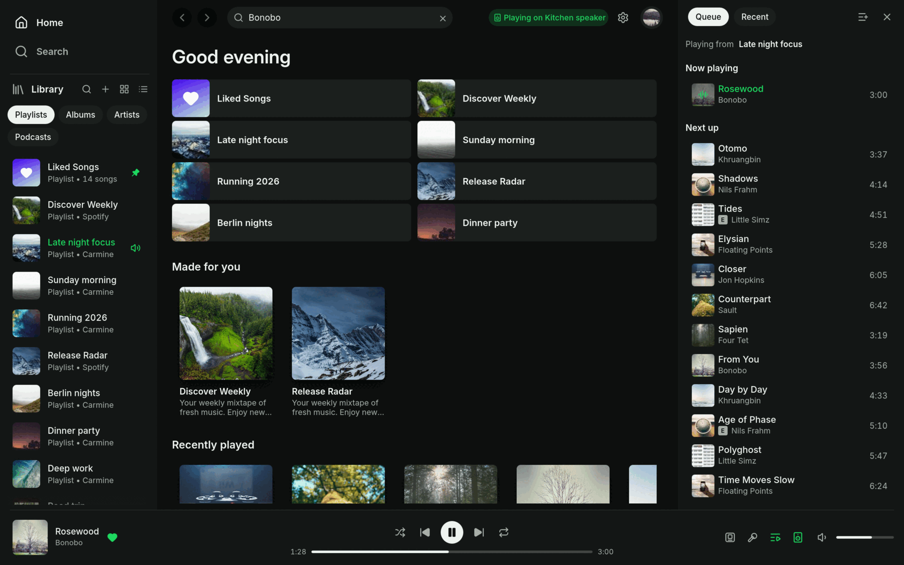
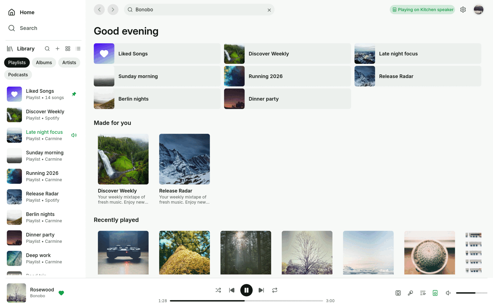
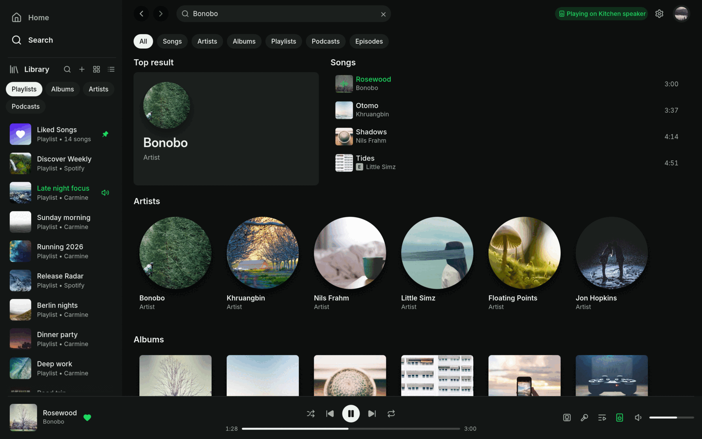
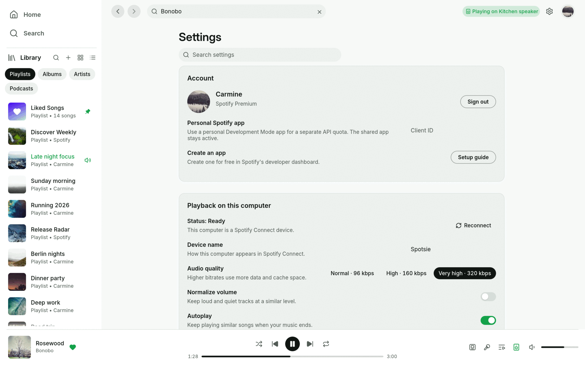

<div align="center">


# Spotsie

**Spotify, native and light, the way Spotify looks.**

Your library, playlists, lyrics and Spotify Connect, in a Rust app that opens
in a blink, plays through [librespot](https://github.com/librespot-org/librespot)
and carries no browser engine.

[Install](#install) · [Features](#features) · [Keyboard](#keyboard) · [Your data](#your-data) · [Building](#building-from-source) · [Website](https://ahaan-shah.github.io/spotsie/)



</div>

**Playback needs Spotify Premium.** Free accounts can browse and search, but
can't play music through Spotsie. Spotsie is an independent project, not made
or endorsed by Spotify.

## Features

**It looks like Spotify.** The sidebar library, the top bar with search, the
player bar along the bottom and the pages in between are laid out the way
Spotify's desktop app has them, so there is nothing new to learn. It just
opens faster and asks your computer for less.

**Plays on this computer, or anywhere.**
- Spotsie is a Spotify Connect speaker of its own, so your phone can send music to it.
- It also controls whatever else is playing: your phone, a speaker, the kitchen.
- Gapless playback, a ten-band equalizer, volume normalization and a choice of streaming quality.
- Media keys, MPRIS on Linux, the macOS Now Playing widget and Windows taskbar buttons.



**Your library.**
- Playlists, albums, artists and podcasts in the sidebar, as a list or a grid, pinned and sorted your way, with folders.
- Liked Songs, Recents and Spotify's own radio for any song, artist or playlist.
- Create, rename and reorder playlists, change their covers, and drag songs where they belong.
- Copy songs with `Ctrl C` and paste them into another playlist with `Ctrl V`.

**Lyrics and the cover.**
- Timed lyrics that follow the song, beside a large cover, on the cover's own colours.
- A cover view that fills the window with the song's artwork.
- Both go full screen. The player bar steps aside and rises again when you reach for it.
- Lyrics come from Spotify when it has them, and from [LRCLIB](https://lrclib.net) when it doesn't.

<table>
<tr>
<td></td>
<td></td>
</tr>
<tr>
<td></td>
<td></td>
</tr>
</table>

**The queue.** Spotify's queue rules, kept exactly: what you add plays next, in
order, before the rest of the album or playlist. Drag to reorder, and see what
plays after.

**Search.** Songs, artists, albums, playlists and podcasts, as you type, with a
top result. `Ctrl F` or `/` from anywhere.



**Everything else.**
- 11 themes, Spotsie Light and Dark plus Catppuccin (Latte and Mocha), Rosé Pine (Dawn and night), Flexoki, Nord, Tokyo Night, Everforest and Gruvbox, that crossfade when you switch. Or let it follow your system, including Omarchy's colours.
- 9 bundled interface fonts, including JetBrains Mono for a monospaced look, so it looks the same everywhere and works offline.
- Calm motion: hovers fade, panels slide, pages rise into place.
- A `spotsie` command that controls the running app, for scripts, launchers and Stream Deck.
- Screen-reader labels, full keyboard control, and 15 languages.
- Updates itself: a quiet **Update available** appears in the top bar, and nothing happens until you click it.



## Install

### Linux & macOS (one line)

```bash
curl -fsSL https://raw.githubusercontent.com/ahaan-shah/spotsie/main/install.sh | sh
```

What the script does on each platform:
- **Linux:** installs Spotsie into `~/.local/lib/spotsie`, links `spotsie` into `~/.local/bin`, and adds a desktop entry and icon so Spotsie shows up in your app launcher. x86-64 and ARM64.
- **macOS:** installs `Spotsie.app` (universal, Apple Silicon + Intel) into `/Applications`.

The script checks every download against the release's `checksums.txt`. To pin
a version, set `SPOTSIE_VERSION=0.1.1`.

The app isn't notarized yet. If macOS refuses to open it the first time,
right-click the app and choose **Open**, or run
`xattr -dr com.apple.quarantine /Applications/Spotsie.app`.

### Windows (one line)

In PowerShell:

```powershell
irm https://raw.githubusercontent.com/ahaan-shah/spotsie/main/install.ps1 | iex
```

This installs Spotsie just for you (no admin prompt) into
`%LOCALAPPDATA%\Programs\Spotsie` and adds it to the Start menu, on x64 and
ARM64 PCs. To pin a version, run `$env:SPOTSIE_VERSION = "0.1.1"` first.

Prefer a regular installer? Download
[`spotsie-setup.exe`](https://github.com/ahaan-shah/spotsie/releases/latest/download/spotsie-setup.exe)
and run it. It isn't code-signed yet, so SmartScreen may say "Windows protected
your PC". Click **More info**, then **Run anyway**.

### Other downloads

The [latest release](https://github.com/ahaan-shah/spotsie/releases/latest)
also has `.deb`, `.rpm` and AppImage builds, a Flatpak bundle, portable
`.tar.gz` and `.zip` archives, and the macOS disk image.

**Uninstall:** on Linux and macOS, run the install line with
`sh -s -- --uninstall` in place of `sh`. On Windows, use **Settings → Apps**.
Your settings and sign-in are kept either way.

## Keyboard

| Keys | Does |
|---|---|
| `Space` | Play or pause |
| `Ctrl ←` / `Ctrl →` | Previous / next |
| `Shift ←` / `Shift →` | Seek 10 seconds |
| `Ctrl ↑` / `Ctrl ↓` | Volume |
| `M` · `B` | Mute · like the playing song |
| `S` / `R` | Shuffle / cycle repeat |
| `Q` | Queue |
| `Ctrl F` or `/` | Search |
| `Ctrl B` | Show or hide the sidebar |
| `Alt ←` / `Alt →` | Back / forward |
| `Ctrl H` / `Ctrl L` | Home / Liked Songs |
| `Ctrl A` · `Ctrl C` · `Ctrl V` | Select all songs · copy their links · paste them into your playlist |
| `Ctrl ,` | Settings |
| `Ctrl /` or `?` | All shortcuts |

On macOS, use `Cmd` instead of `Ctrl`.

### From the command line

The `spotsie` command controls the copy that's already running:

```
spotsie play-pause          spotsie volume 40
spotsie next                spotsie shuffle on
spotsie like                spotsie play-uri spotify:playlist:37i9…
spotsie now-playing         spotsie devices
```

See [Everyday use](docs/_guide/using-spotsie.md#controlling-it-from-the-command-line) for every verb.

## Your data

There's no Spotsie account, no telemetry and no hosted service. Spotsie talks
to Spotify, and to three other places, each for one thing:

- **Spotify**, for your library, search and playback, signed in with Spotify's own login page. Sign-ins live in your system's keyring.
- **[LRCLIB](https://lrclib.net)**, for lyrics when Spotify has none: the song's artist, title, album and length, nothing about you.
- **GitHub**, once on each launch, to see whether a newer Spotsie exists. Updates are only downloaded when you click **Update available**.
- **Your local network**, to find Spotify Connect speakers.

| | Linux | macOS | Windows |
|---|---|---|---|
| Settings | `~/.config/spotsie/` | `~/Library/Application Support/io.github.ahaan-shah.spotsie/` | `%APPDATA%\ahaan-shah\spotsie\config\` |
| State & logs | `~/.local/state/spotsie/` | (same as settings) | `%LOCALAPPDATA%\ahaan-shah\spotsie\data\` |
| Caches | `~/.cache/spotsie/` | `~/Library/Caches/io.github.ahaan-shah.spotsie/` | `%LOCALAPPDATA%\ahaan-shah\spotsie\cache\` |

Clearing the caches never signs you out. [Settings and files](docs/_reference/settings-and-files.md)
and [Privacy](docs/_reference/privacy.md) have the details, and
[How it connects](docs/_reference/how-it-connects.md) lists every request.

Want to look around first? `spotsie --demo` (in a build with the `demo`
feature) opens a sample library that needs no Spotify account.

## Building from source

```bash
git clone https://github.com/ahaan-shah/spotsie.git
cd spotsie
cargo run --release
```

Rust 1.98+ is required. On Arch Linux, first run
`sudo pacman -S --needed base-devel alsa-lib libpulse libxkbcommon wayland`;
other systems are in [Build from source](docs/_guide/getting-started.md#build-from-source).
`scripts/install.sh` builds the checkout and installs it for your user.

To look at the interface without a Spotify account:

```bash
cargo run --features demo -- --demo
```

See [CONTRIBUTING.md](CONTRIBUTING.md) for the project's checks and layout, and
[AGENTS.md](AGENTS.md) for coding agents. Translations live in `assets/i18n/`
([Translating](docs/_reference/translating.md)).

## Credits

Spotsie started from the code of [Spotifast](https://github.com/crmne/spotifast)
by [Carmine Paolino](https://github.com/crmne) (MIT). Its sign-in, playback,
Spotify Connect, Web API, settings and storage are Spotifast's proven backend;
the interface is Spotsie's own. Thank you, Carmine.

Spotsie also stands on [librespot](https://github.com/librespot-org/librespot),
[egui](https://github.com/emilk/egui), the [Inter](https://rsms.me/inter/) typeface and
other bundled fonts (OFL), and [Lucide](https://lucide.dev) icons (ISC).
Lyrics come from Spotify and [LRCLIB](https://lrclib.net).

Music, artwork, metadata and lyrics belong to their owners and come from
**Spotify**, through your own account. Spotify is a trademark of Spotify AB.
Spotsie is an independent project and is not affiliated with, endorsed by or
sponsored by Spotify.

## License

[MIT](LICENSE). The bundled fonts and icons keep their own licenses, next to
them in [`assets/`](assets).
