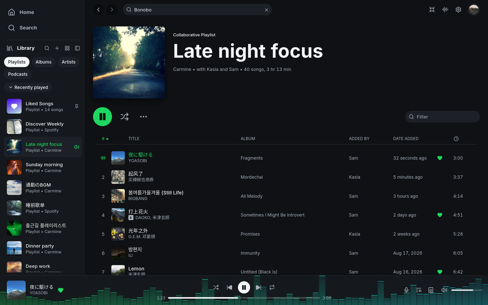

## Install

Choose your system on the [Download page](https://github.com/ahaan-shah/spotsie/releases) and follow its
installation steps. Then open **Spotsie**.

## Sign in

Press **Sign in with Spotify**. Your browser opens Spotify's sign-in page.
Approve access there, then return to Spotsie to see your library.
Spotsie never sees your Spotify password.

Spotsie remembers your sign-in using your computer's protected storage,
so you normally do not need to sign in each time you open the app.

## Enable playback on this computer

**Playing music requires Spotify Premium.** To listen on this computer,
open the device menu in the bottom player bar and select **Set up playback
here**, or find the same option in Settings.

Spotify asks you to approve playback separately from library access. Follow
the browser prompt once; Spotsie remembers this approval too.
[Read more about the two sign-ins](../_reference/how-it-connects.md).

The computer then appears as a Spotify Connect device named **Spotsie**.
You can rename it in Settings.

## Basics

- **Closing the window does not stop the music.** Spotsie keeps playing
  from the system tray; reopen it from the tray icon and quit from the tray
  menu or Ctrl+Q. On macOS you can also reopen it from the Dock. Settings can
  turn this off. On Linux, including Flatpak, a desktop with a working system
  tray is required for this behavior.
- **Play and Pause fade.** With the default audio settings, music played on
  this computer fades in or out to avoid a hard cut.
- **Play buttons show progress.** The button spins until Spotify responds.
- **Artist names are links.** Click a credited artist in the player bar to
  open their page, even while the rest of the song's details are loading.
- **Common actions have shortcuts.** Space plays and pauses, Ctrl+F or `/`
  searches, and `Q` opens the queue. Ctrl+/ shows the full list.
- **Right-click for more actions.** Right-click a song, playlist, album,
  artist, or podcast to see its menu. These menus are available in Home,
  Search, Library, and artist pages. Your own playlists include **Edit details**
  and **Delete**. Opening a menu does not start playback.
  In **Add to playlist**, type a playlist name to find it, or choose
  **New playlist**. Typing chooses the first match, so `Enter` adds to it;
  the up and down arrows choose another. You can add one song or a selection.
  If the playlist already contains the song, Spotsie asks before adding
  another copy.
- **Spotify links open in Spotsie.** A `spotify:` link shared from another
  app opens its page, starting Spotsie if it is not running. Links to
  `open.spotify.com` go through the browser first, which hands them over the
  same way. `spotsie <link>` does the same from a terminal.

## Match your desktop theme

Open **Settings → Appearance → Theme** and choose **Follow system**, Spotsie's
**Light** or **Dark**, or one of Magpie's themes. Follow system wears your
desktop's pywal palette when there is one (on hyprahaan, the bar's and
dock's colours, following every change), and otherwise matches your
desktop's light or dark appearance. **Font**, just below, offers Inter and
Magpie's other bundled fonts.

On Omarchy, Spotsie matches your desktop theme from the first time you open
it; the AUR package also installs the theme hook. Choose **Follow system** or **Omarchy**, then change your
desktop theme: Spotsie's colours follow while the music keeps playing.
New installations already use Follow system. Updating keeps your previous
theme choice.

For your own colours or a manual installation, see
[custom themes and Omarchy setup](../_reference/settings-and-files.md#custom-themes).

## If song titles show empty boxes

Spotsie uses your computer's fonts to display titles in different languages.
macOS and Windows already include fonts for most languages. On Linux,
install `noto-fonts` and `noto-fonts-cjk` (Arch) or `fonts-noto` and
`fonts-noto-cjk` (Debian or Ubuntu) if letters are missing.
For colour emoji, install the desktop's colour emoji font
(`noto-fonts-emoji` on Arch, `fonts-noto-color-emoji` on Debian or Ubuntu).

Titles can mix languages, including those written from right to left.
Long titles are shortened with dots to fit the available space.



## Choosing the interface language

Spotsie uses your computer's language when it has a translation for it, and
English otherwise. To pick another language, open **Settings → Appearance →
Language**. Each language is listed under its own name, and the change applies
at once. Choose **System** to follow the computer again. Spanish and Turkish
are complete; other translations are in progress, and anything not yet translated
appears in English. See [Translating Spotsie](../_reference/translating.md) to help.

## Choosing which app opens Spotify links

On macOS, opening Spotsie makes it available for Spotify links. If Spotify's
own app is installed too, macOS uses whichever app last registered for them.
On Windows, choose the app in **Settings → Apps → Default apps**.

On Linux, after installing the current app launcher:

```sh
xdg-mime default spotsie.desktop x-scheme-handler/spotify
```

## If your network needs a proxy

**In development, not included in 0.8.0:** you can configure a proxy, a server
your network uses to reach the internet, on the sign-in screen or in
**Settings → Proxy**. Enter the address, port, and any login details supplied
by your network administrator. Spotsie protects the saved proxy password.
If it cannot save the password, it tells you and uses it only until you quit.

Playing music on this computer supports only HTTP proxies without a login.
With other proxy types, music connects directly to Spotify even though
browsing uses the proxy. Your browser has separate proxy settings, which may
also need configuring for sign-in.
See [proxy options and limits](../_reference/how-it-connects.md#proxy).

## Build from source

Build the single binary with Rust 1.98 or newer:

```bash
cargo install --git https://github.com/ahaan-shah/spotsie --locked
```

On Linux, you need a C compiler and the development packages for ALSA,
PulseAudio or PipeWire, and the windowing libraries. On Arch:

```bash
sudo pacman -S --needed base-devel alsa-lib libpulse libxkbcommon wayland
```

On Debian or Ubuntu:

```bash
sudo apt install build-essential libasound2-dev libpulse-dev libxkbcommon-dev \
  libwayland-dev
```

On Fedora:

```bash
sudo dnf install gcc alsa-lib-devel pulseaudio-libs-devel libxkbcommon-devel \
  wayland-devel
```

On Windows, install the Visual Studio C++ build tools.
